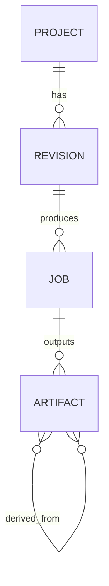

# Local AI Video Pipeline Architecture Plan

## Purpose

Build a local-first API platform for AI-assisted video creation that starts with:

- prompt text
- source MP3

and moves through these stages:

1. transcript and timing extraction
2. editable video plan generation
3. storyboard still generation
4. shot render generation
5. timeline assembly
6. DaVinci Resolve project export for human finishing

The system should support a **12 GB VRAM-friendly local mode** and a **cloud fallback mode** without changing the core application contract.

---

## Goals

- Keep orchestration, metadata, versioning, and editorial control inside our application
- Use local models by default
- Allow cloud execution for GPU-heavy stages when needed
- Make all intermediate artifacts editable and reproducible
- Support power-user editing in VS Code
- Add a lightweight web UI for review and approvals
- Export a DaVinci Resolve project as the final handoff format

---

## Non-Goals

- Building a full consumer-grade NLE
- Replacing Resolve for final editing, audio mixing, or finishing
- Treating the LLM as the source of truth instead of structured project data
- Hiding prompt/model provenance from the pipeline

---

## Core Design Principles

### 1. Local-first, provider-agnostic generation

The application should own the workflow. Model execution is a pluggable backend.

Every major generation task should use the same internal contract regardless of provider:

- `plan.generate`
- `storyboard.generate`
- `shot.generate`
- `timeline.export`

Each job should be routed to:

- `provider: local`
- `provider: cloud`

This allows us to switch expensive stages to cloud without redesigning the system.

### 2. Structured intermediates over opaque prompts

The pipeline should not pass raw prose between stages. Each stage should emit versioned structured documents.

Recommended editable files:

- `project.plan.json`
- `storyboard.index.json`
- `shots/shot-001.json`
- `timeline.otio`

These files should be validated with JSON Schema and stored in Git-friendly form.

### 3. Immutable artifacts with revision history

All generated assets should be stored as immutable artifacts with metadata:

- source revision
- prompt text
- negative prompt
- seed
- model id
- model version / weights hash
- inference parameters
- creation timestamp
- parent artifact references

User edits create new revisions rather than mutating history.

### 4. Human approval between stages

The pipeline should pause for review at key checkpoints:

- plan review
- storyboard review
- shot review
- timeline export review

This keeps the system editorially useful rather than fully autonomous and brittle.

---

## High-Level Workflow

```mermaid
flowchart LR
    A[Prompt Text + MP3] --> B[ASR + Timing]
    B --> C[Plan Generation]
    C --> D[Editable Video Plan]
    D --> E[Storyboard Still Generation]
    E --> F[Editable Storyboards]
    F --> G[Shot Render Generation]
    G --> H[Rendered Shots / Frame Sequences]
    H --> I[Timeline Assembly]
    I --> J[OTIO Export]
    J --> K[DaVinci Resolve Project Export]
```



---

## Major Components

## 1. API Gateway

Responsibilities:

- authentication
- request validation
- project creation
- job creation
- status endpoints
- artifact access control

Suggested approach:

- REST API for deterministic stage operations
- optional WebSocket or SSE for job progress

---

## 2. Orchestrator

Responsibilities:

- stage sequencing
- dependency tracking
- retries
- idempotency
- provider selection
- downstream invalidation when an upstream revision changes

The orchestrator should understand artifact lineage so that a change to a storyboard only invalidates dependent shot renders, not the entire project.

---

## 3. Project Store

Split into two layers:

### Metadata store

Holds:

- projects
- revisions
- job records
- prompts
- model metadata
- timeline metadata
- artifact relationships

A relational database such as PostgreSQL is a good fit.

### Blob store

Holds:

- source MP3
- transcripts
- storyboard PNGs
- rendered clips
- frame sequences
- OTIO files
- exported Resolve packages

This can start as local disk storage and later move to object storage.

---

## 4. Planning Service

Input:

- user text prompt
- transcript and timing data
- optional beat analysis
- project constraints

Output:

- structured plan JSON

The plan should include:

- overall concept
- global visual bible
- shot list
- shot durations
- shot prompts
- continuity rules
- camera intent
- transition intent
- audio sync notes

### Example plan shape

```json
{
  "plan_id": "plan_r1",
  "target_fps": 24,
  "target_resolution": "1920x1080",
  "global_style": {
    "visual_bible": "warm cinematic realism, shallow depth of field",
    "negative_constraints": "bad anatomy, text artifacts, extra limbs"
  },
  "shots": [
    {
      "shot_id": "sh_001",
      "start_s": 0.0,
      "end_s": 4.0,
      "purpose": "establishing shot",
      "prompt": "wide sunrise shot over orange grove",
      "negative_prompt": "blurry, distorted",
      "camera": {
        "framing": "wide",
        "move": "slow_dolly_in",
        "lens_mm": 35
      },
      "audio": {
        "use_source_mp3": true,
        "dialogue_ranges": []
      },
      "generation": {
        "seed": 42,
        "model_profile": "storyboard_sdxl_v1"
      }
    }
  ]
}
```

---

## 5. Storyboard Service

Input:

- approved plan revision

Output:

- one or more storyboard stills per shot
- associated seeds and generation metadata

Each storyboard should store:

- prompt used
- negative prompt used
- seed
- model profile
- reference assets
- composition lock notes

Storyboards should be treated as the visual contract for later shot generation.

---

## 6. Shot Render Service

Input:

- approved storyboard revision
- shot prompt
- motion rules
- camera intent
- duration targets

Output:

- rendered shot clips or frame sequences
- render manifest
- QC metadata

The service should support:

- short image-to-video generation
- segment chaining for longer shots
- frame interpolation / retiming
- optional upscaling
- optional talking-head or lip-sync specialty flows

---

## 7. Audio Analysis Service

Responsibilities:

- transcription
- segment timing
- optional word-level timing
- beat detection
- speech/music segmentation
- loudness and pacing metadata

This stage informs:

- shot boundaries
- title card timing
- talking-head sync
- transition timing
- beat-aligned edits

---

## 8. Timeline Service

Input:

- approved renders
- source MP3
- edit metadata

Output:

- OTIO timeline
- Resolve-ready project assembly instructions

This service should build:

- bins
- track layout
- shot order
- clip durations
- markers
- audio placement

---

## 9. Resolve Export Service

The most reliable way to produce a `.drp` is to drive DaVinci Resolve itself through scripting rather than trying to synthesize `.drp` directly.

Recommended flow:

1. create or open project in Resolve
2. import media into bins
3. create timeline
4. append clips and audio
5. add markers / metadata
6. export project as `.drp`

Also generate OTIO as an intermediate and testable interchange artifact.

---

## Recommended Local Stack

## Baseline for 12 GB VRAM

### Local-friendly stages

- transcription
- timing analysis
- plan generation
- plan editing
- storyboard still generation
- OTIO generation
- Resolve export orchestration

### Most likely cloud fallback stage

- final shot video generation

### Model role suggestions

- **ASR**: Whisper-family local runtime
- **Planning LLM**: small quantized instruct model with strong structured JSON output
- **Storyboards**: SDXL-class image model with controllable adapters
- **Video**: image-to-video pipeline for short segments, interpolation for retiming

---

## Provider Abstraction

Every generation service should conform to a shared job contract.

### Example internal job format

```json
{
  "job_type": "storyboard.generate",
  "provider": "local",
  "project_id": "prj_001",
  "input_revision": "plan_r2",
  "payload": {
    "shots": ["sh_001", "sh_002"]
  }
}
```

### Provider behavior

A provider implementation should return:

- status
- output artifact ids
- logs
- metrics
- failure details
- reproducibility metadata

This makes it easy to move a stage from local to cloud later.

---

## Revision and Artifact Model

## Core entities

### Project

Top-level container for everything.

### Revision

A versioned state of a stage, such as:

- `transcript_r1`
- `plan_r2`
- `storyboard_r3`
- `render_r4`

### Artifact

A file or structured output such as:

- mp3
- transcript json
- png
- mp4
- frame manifest
- otio
- drp

### Job

An execution record for one stage.

---

## Example relationship model



---

## Editing Workflow

## VS Code workflow

Power users should be able to edit project files directly in VS Code.

Recommended developer experience:

- JSON Schema validation
- checked-in project revisions
- diffable shot edits
- manual overrides without UI dependence
- scripted batch transforms

### Good candidates for direct editing

- plan JSON
- storyboard metadata
- shot timing
- generation constraints
- timeline overrides

## Web UI workflow

The web UI should focus on review and approval, not replace file-based editing.

### Phase 1 UI goals

- project list
- transcript viewer
- raw JSON plan viewer/editor
- storyboard gallery
- approve / reject / regenerate controls
- shot render preview
- job progress
- export controls

### Later UI goals

- drag-based shot reordering
- side-by-side storyboard comparison
- marker editing
- continuity dashboard
- prompt/seed diff tools

---

## API Design

## Core endpoints

### Projects

- `POST /v1/projects`
- `GET /v1/projects/{projectId}`

### Transcript and planning

- `POST /v1/projects/{projectId}/plan:generate`
- `PATCH /v1/projects/{projectId}/plan/{revisionId}`

### Storyboards

- `POST /v1/projects/{projectId}/storyboard:generate`
- `PATCH /v1/projects/{projectId}/storyboard/{revisionId}`

### Renders

- `POST /v1/projects/{projectId}/renders:generate`

### Timeline and export

- `POST /v1/projects/{projectId}/timeline:build`
- `POST /v1/projects/{projectId}/resolve:export`

### Jobs

- `GET /v1/jobs/{jobId}`

---

## Example project creation flow

```http
POST /v1/projects
Content-Type: multipart/form-data
```

Payload:

- `prompt_text`
- `audio_mp3`
- `options`

Response:

```json
{
  "project_id": "prj_001",
  "job_id": "job_001",
  "status": "queued"
}
```

---

## Example storyboard generation flow

```json
{
  "plan_revision": "plan_r2",
  "shots": ["sh_001", "sh_002"],
  "provider": "local",
  "render_profile": "storyboard_sdxl_v1"
}
```

---

## Example render generation flow

```json
{
  "storyboard_revision": "storyboard_r1",
  "provider": "cloud",
  "target": {
    "type": "clip",
    "fps": 24,
    "resolution": "1920x1080"
  },
  "shot_policy": {
    "default_strategy": "i2v_segment_chain",
    "max_segment_s": 3.0,
    "interpolate": true
  }
}
```

---

## Directory Layout Suggestion

```text
project-root/
  docs/
    architecture-plan.md
  schemas/
    video-plan.schema.json
    storyboard.schema.json
    shot-render.schema.json
  src/
    api/
    orchestrator/
    providers/
      local/
      cloud/
    services/
      asr/
      planning/
      storyboard/
      render/
      timeline/
      resolve/
    storage/
    domain/
  projects/
    prj_001/
      source/
      revisions/
      artifacts/
      exports/
```

---

## Initial Milestones

## Milestone 1: foundations

- project creation
- artifact store
- job tracking
- transcript ingestion
- JSON schemas

## Milestone 2: plan generation

- local transcription
- plan JSON generation
- plan validation
- VS Code editing workflow

## Milestone 3: storyboard pipeline

- storyboard generation
- gallery review
- seed/provenance capture
- storyboard revisioning

## Milestone 4: shot generation

- short clip generation
- interpolation / retiming
- render manifests
- QC metadata

## Milestone 5: timeline and Resolve export

- OTIO generation
- Resolve scripting integration
- `.drp` export
- end-to-end smoke tests

---

## Key Risks

### 1. Video generation cost and latency

Mitigation:

- keep storyboard generation local
- allow cloud only for expensive shot generation
- cache aggressively
- reuse approved frames and seeds

### 2. Visual inconsistency

Mitigation:

- storyboard approval gates
- strong shot metadata
- reference-image conditioning
- locked seeds and model profiles
- shot-level anchor frames

### 3. Schema drift between stages

Mitigation:

- strict JSON schemas
- automated validation
- revision immutability
- compatibility tests across services

### 4. Resolve automation brittleness

Mitigation:

- keep OTIO as intermediate truth
- isolate Resolve export logic
- smoke test exports in CI where possible
- keep final conform deterministic

---

## Recommended First Release

For the first production-capable version, ship this split:

### Local

- transcription
- timing analysis
- planning
- plan editing
- storyboard stills
- OTIO generation
- Resolve export orchestration

### Optional cloud

- expensive shot video generation only

This keeps the product usable early, minimizes cost, and avoids tying the whole architecture to one GPU class.

---

## Final Recommendation

Build the system around these truths:

- our app owns the workflow
- structured files are the source of truth
- human review happens between stages
- local is the default
- cloud is a clean provider swap
- OTIO is the interchange backbone
- Resolve `.drp` is the finishing handoff

That gives us a practical architecture that works on modest hardware now and scales to heavier generation later.

---

## Next Step

Create these three project assets first:

1. `docs/architecture-plan.md`
2. `schemas/video-plan.schema.json`
3. `src/domain/project-types.ts` or equivalent domain model definitions
